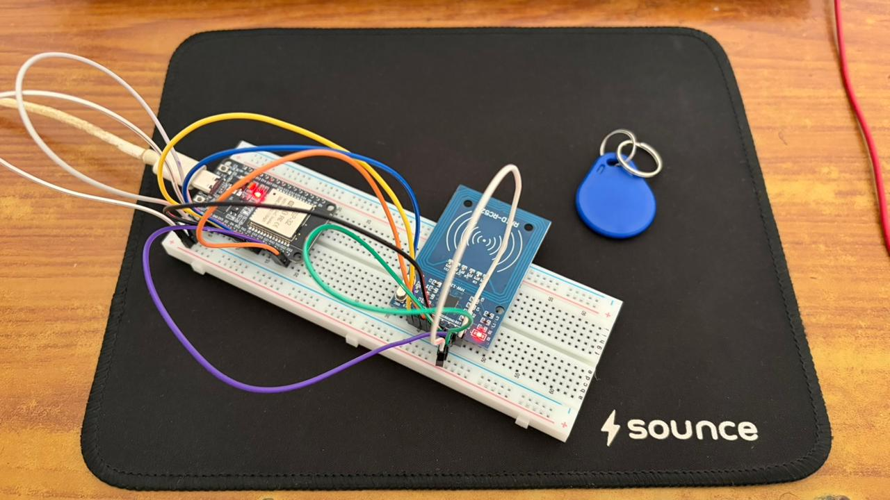
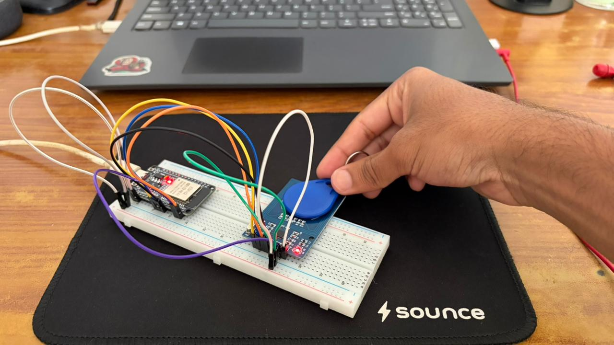
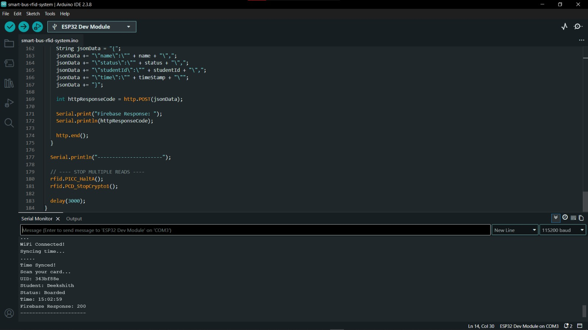
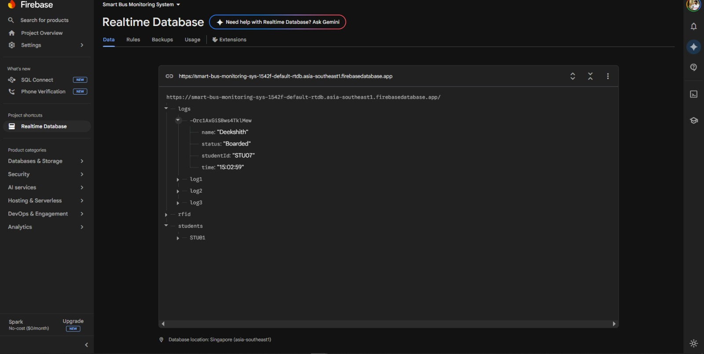

# 🚍 Smart Bus Monitoring System

An IoT-based RFID system using ESP32 to track student boarding and exiting in real-time using Firebase.

---

## 🔧 Features

- RFID-based student identification  
- Real-time status tracking (Boarded / Exited)  
- WiFi-enabled ESP32 communication  
- Firebase cloud data logging  
- Real-time timestamp using NTP  

---

## 🛠 Tech Stack

- ESP32  
- RC522 RFID Module  
- Arduino IDE  
- Firebase Realtime Database  
- HTTP (REST API)  

---

## ⚙️ How it Works

1. Student taps RFID card  
2. RC522 reads the UID  
3. ESP32 matches student data  
4. Status toggles (Boarded ↔ Exited)  
5. Data is sent to Firebase in real-time  

---

## 🔌 Circuit Connections

| RC522 Pin | ESP32 Pin |
|----------|----------|
| SDA (SS) | GPIO 5 |
| SCK      | GPIO 18 |
| MOSI     | GPIO 23 |
| MISO     | GPIO 19 |
| RST      | GPIO 22 |
| GND      | GND |
| 3.3V     | 3.3V |

---

## 📊 Sample Output
UID: 343bf88e
Student: Deekshith
Status: Boarded
Time: 15:02:59
Firebase Response: 200

---

## 📸 Project Demo

### 🔧 Hardware Setup

### 📡 RFID Scanning

### 💻 Serial Output

### ☁️ Firebase Data

---

## 📊 Results

- Real-time tracking achieved  
- Reliable Firebase updates  
- Fast response (~1–2 seconds)  

---

## 🚀 Future Improvements

- Mobile dashboard  
- GPS-based tracking  
- Notifications system  

---

## 👨‍💻 Author

Deekshith Gowda
